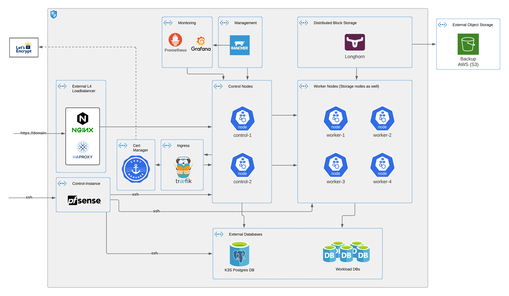
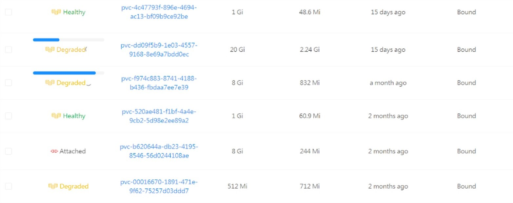
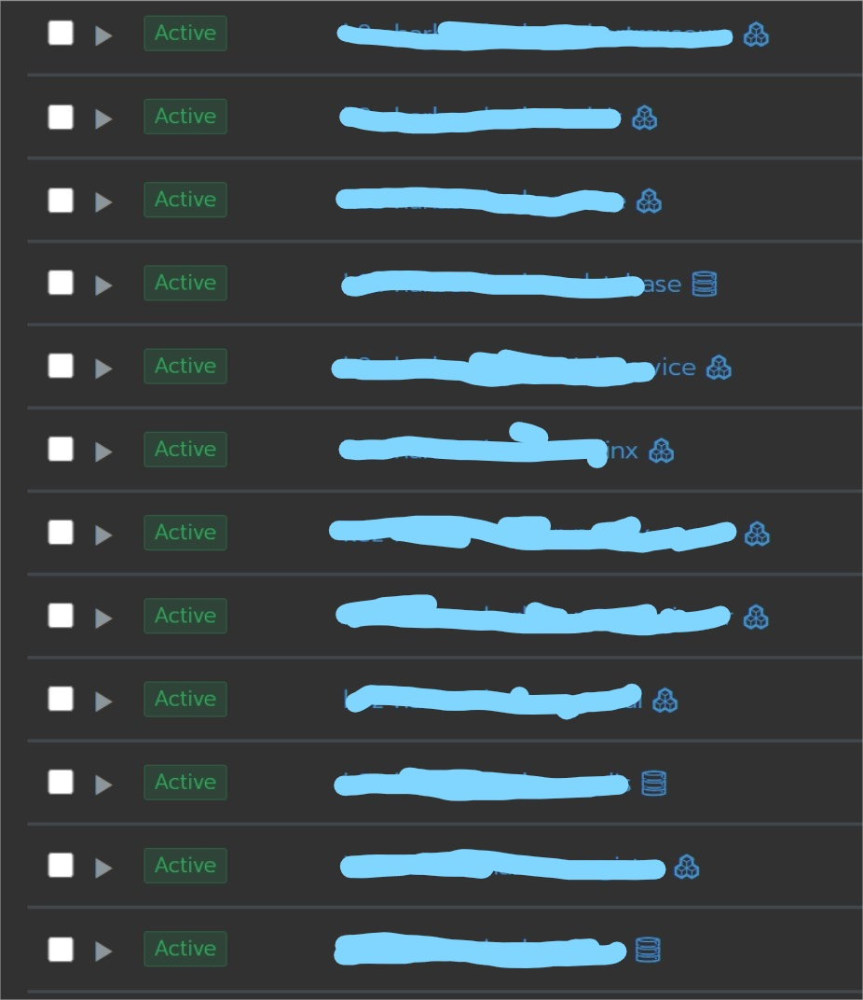

# ha-k3s-cluster
[CNCN Community](https://community.cncn.io/)

As asked by [@adriandotgoins](https://twitter.com/adriandotgoins), I thought I'd share how I set up my Kubernetes personal playground (a WIP), and share my personal experience with the [OVH Incident](https://www.reuters.com/article/us-france-ovh-fire-idUSKBN2B20NU). Hopefully this might be useful for someone, and it gives me a chance to contribute back to the CNCN community.

---

#### Shortcuts
- [My starting cluster layout](#my-starting-cluster-layout)
- [Manual cluster install](#manual-cluster-install)
- [Ansible cluster install](#ansible-cluster-install)
- [Installing Rancher, Traefik, Cert-Manager and Longhorn](#installing-rancher-traefik-cert-manager-and-longhorn)
- [OVH Incident](#ovh-incident)
- [WSL Setup](./wsl)
- [External LB config](nginx/nginx.config)

---

### My starting cluster layout
As I'm on a tight cloud budget (after some unfortunate accidents :heavy_dollar_sign: :heavy_dollar_sign:), I usually go with the minimum 2 control nodes and 4~5 worker nodes, an HA external Postgres DB for k3s, an external LB (Nginx or HAproxy, I don't need HA LB for now), and a control node to serve as rebound for ssh and admin stuff. I usually try to spread those nodes across multiple providers / locations within the constraints of my budget.



---
### Manual cluster install
K3s is currently my by-default option for kubernetes, I mainly rely on Rancher documentation to get going, with some adjustment that suit my needs. I summed up my [step by step install here](manual-install/README.md).

---
### Ansible cluster install 
I eventually moved to a faster more streamlined way of installing a cluster with ansible, using this [ansible-role](https://github.com/PyratLabs/ansible-role-k3s) as base (I add custom stuff), and to save you some time here is the playbook i run it with.
```yaml
---

- name: Build k3s cluster
  hosts: k3s_cluster
  vars:
    k3s_state: installed
    k3s_release_version: v1.19
    k3s_build_cluster: true
    k3s_become_for_all: true
    k3s_control_node_address: "{{k3s_loadbalancer_ip}}" # loadbalancer
    k3s_server:
      datastore-endpoint: "postgres://k3s:{{k3s_postgres_password}}@{{k3s_postgres_hostname}}:5432/k3s" # add ?sslmode=disable to disable ssl
      with-node-id: false
      docker: false
      write-kubeconfig-mode: "0644"
      node-taint:
        - "CriticalAddonsOnly=true:NoExecute" # prevent control nodes from acting as workers
      tls-san:
        - "{{k3s_loadbalancer_ip}}" # important to add LB ip to kubeconfig certificate
        # you can add other ip addreses
      disable:
        - traefik # to disable traefik and install it manually (if you want to use Traefik V2)
    k3s_agent:
      with-node-id: false
  roles:
    - role: k3s # the role mentioned above
```
You need to feed it an inventory that looks like this:
```yaml
---
k3s_control_nodes:
  hosts:
    control-1:
      ansible_user: <ansible_user>
      ansible_host: <host_ip>
      k3s_control_node: true
    control-2:
      ansible_user: <ansible_user>
      ansible_host: <host_ip>
      k3s_control_node: true

k3s_worker_nodes:
  hosts:
    worker-1:
      ansible_user: <ansible_user>
      ansible_host: <host_ip>
      k3s_control_node: false
    worker-2:
      ansible_user: <ansible_user>
      ansible_host: <host_ip>
      k3s_control_node: false
      
k3s_cluster:
  hosts:
    control-1:
    control-2:
    worker-1:
    worker-2:
    worker-3:
```

---
### External LB config
```
worker_processes 4;
worker_rlimit_nofile 40000;
include /etc/nginx/modules-enabled/*.conf;

events {
    worker_connections 8192;
}

stream {
        upstream http_servers {
                least_conn;
                server <NODE_IP>:80 max_fails=3 fail_timeout=5s;
                server <NODE_IP>:80 max_fails=3 fail_timeout=5s;
                server <NODE_IP>:80 max_fails=3 fail_timeout=5s;
                server <NODE_IP>:80 max_fails=3 fail_timeout=5s;
        }

        upstream https_servers {
                least_conn;
                server <NODE_IP>:443 max_fails=3 fail_timeout=5s;
                server <NODE_IP>:443 max_fails=3 fail_timeout=5s;
                server <NODE_IP>:443 max_fails=3 fail_timeout=5s;
                server <NODE_IP>:443 max_fails=3 fail_timeout=5s;
        }

        upstream k3s_servers {
                server <CONTROL_NODE_IP>:6443;
                server <CONTROL_NODE_IP>:6443;
        }

        server {
                listen 80;
                proxy_pass http_servers;
        }

        server {
                listen 443;
                proxy_pass https_servers;
        }

        server {
                listen 6443;
                proxy_pass k3s_servers;
        }
}
```

---
### Installing Rancher, Traefik, Cert-Manager and Longhorn
Your can go for the documentation of each solution to install, or use my [ansible playbook here](ansible). First customize the values in [here](k8s).

---
### OVH Incident
After the OVH data-center @Strasbourg burner down, 3 of my nodes went down with it, 2 workers and a db replica, so out of the 4 workers I had only 2 were up (as they were hosted @Gravelin datacenter).


---

My first mistake was to put 2 nodes at Strasbourg and 2 at Gravelin, I should have gone for a different location for each node, since my worker nodes were also my data storage nodes.
That being said, it took kubernetes some time to recover. I haven’t yet taken time to look into the k8s docs, to understand how long it waits for nodes to recover before it tries to reschedule certain workloads on available nodes. Deleting the nodes manually usually helps speed up the process.


---

But most of my workloads that relied on data persistence were struggling to go back up.


---

My second mistake was not having an odd number of worker nodes. The default longhorn replica count is 3, with only 2 available nodes the volumes were failing to mount. 


---

Thankfully longhorn has an option allowing scheduling on the same node.





---

After that was ticked the missing replicas were recreated, and my workloads were back up. Not losing any data in the process.



---


---

I eventually provided 2 new worker nodes and disabled the Soft anti-affinity option, and got back to a normal setup.
I also do have a safety option that is the backup to aws S3 provided by Longhorn. Which can be tricky to do, when restoring to new nodes but definitely a must-have, since S3 storage is rather cheap.
I'm currently looking into the Rancher backup option as well as Velero for overkill.
